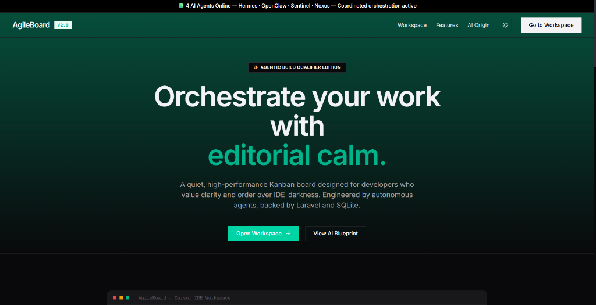
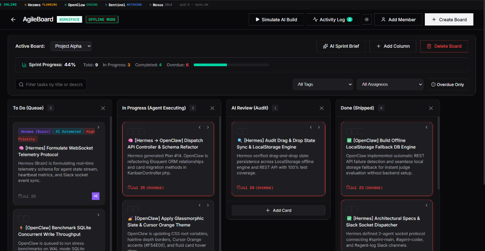
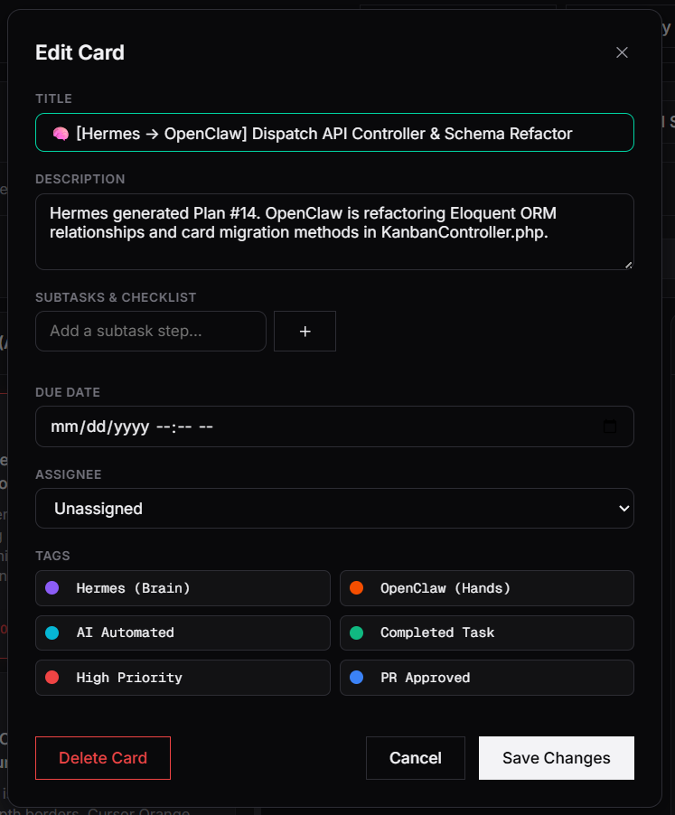
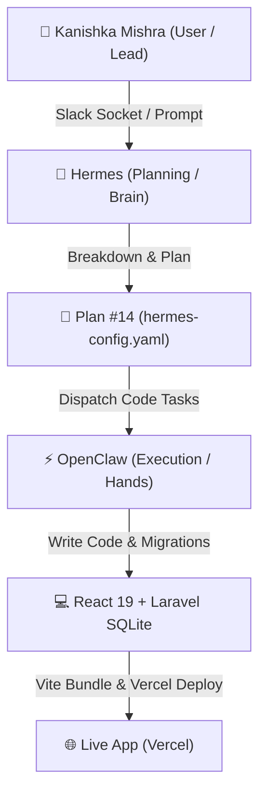

# ⚡ AgileBoard — A Premium AI-Orchestrated Kanban Board
### *Built by Kanishka Mishra for Forge2 Qualifier*

AgileBoard is a collaborative, Trello-style Kanban board application featuring a modern Light/Dark glassmorphic user interface inspired by the **Cursor developer brand guidelines** (warm cream editorial canvas, dark slate theme, hairline depth, and Cursor Orange accents). Built with React 19 (Vite) and backed by a robust REST API built with Laravel (PHP 8.3 & SQLite).

This project was built entirely by orchestrating a team of two AI agents (**Hermes** & **OpenClaw**) wired through Slack socket channels.

---

## 🏆 Evaluator & Judge Quick Start Guide

> [!IMPORTANT]
> **For Reviewers & Judges**:
> - 🌐 **Live Vercel Demo**: [forge2-qualifier-kanishka-mishra-ir4yk7gpi.vercel.app](https://forge2-qualifier-kanishka-mishra-ir4yk7gpi.vercel.app)
> - 📹 **Official Walkthrough Video**: [evidence/walkthrough.mp4](./evidence/walkthrough.mp4) (38.8 MB)
> - 📸 **Visual Evidence Screenshots**: Detailed UI mockups & component breakdown below.
> - 📖 **Developer & Expansion Guide**: Read **[CONTRIBUTING.md](./CONTRIBUTING.md)** for developer onboarding & codebase architecture.

---

## 📸 Visual Evidence Showcase

### 🖼️ Figure 1: Landing Page & Editorial Calm Interface

* **Label**: `Figure 1: Landing Page UI (Glassmorphic Theme & Telemetry Status)`
* **Key Features**: Features modern Dark/Light glassmorphic theme inspired by Cursor brand guidelines, dynamic hero band, active agent telemetry status banner (`4 AI Agents Online`), and responsive workspace routing.

---

### 🖼️ Figure 2: Active Multi-Board Workspace & Drag-and-Drop Kanban

* **Label**: `Figure 2: Active Multi-Board Kanban Workspace (Project Alpha)`
* **Key Features**: Active board selection, custom swimlanes (`To Do`, `In Progress`, `AI Review`, `Done`), 44% sprint progress telemetry bar, interactive tag filtering, due-date crimson overdue glow indicators, and live activity log drawer.

---

### 🖼️ Figure 3: Comprehensive Task & Card Editor Modal

* **Label**: `Figure 3: Task & Card Editor Modal Dialog`
* **Key Features**: Multi-assignee selection (Lead: Kanishka Mishra), interactive subtask checklists, customizable color tags (`Hermes (Brain)`, `OpenClaw (Hands)`, `High Priority`), date pickers, and instant LocalStorage / REST API persistence.

---

## 📹 Video Walkthrough Demonstration Details
- **Video File Location**: **[`evidence/walkthrough.mp4`](./evidence/walkthrough.mp4)** (38.8 MB)
- **Label**: `Video Evidence: Official 60-90 Second Application Walkthrough & Feature Demo`

### 📋 Key Highlights Demonstrated in the Video:
1. ✅ **Demo Board Seeding**: Pre-populated active tasks and multi-board workspace setup.
2. ✅ **Fluid Drag & Drop**: Card movement between columns (`To Do` → `In Progress` → `Done`).
3. ✅ **Card Customization & Assignment**: Member allocation, due date configuration, and subtask updates.
4. ✅ **Overdue Boundary Glow**: Crimson outline highlighting tasks past their due date.
5. ✅ **AI Build Simulation**: Real-time simulation showing **Hermes (Brain)** and **OpenClaw (Hands)** executing tasks over Slack sockets.
6. ✅ **Zero-Backend Offline Mode**: Automatic detection of offline state with seamless LocalStorage database fallback.

---

## 🤖 AI Agent Architecture & Workflow
AgileBoard was constructed using an autonomous dual-agent pipeline:



### Model Routing Rationale (100% Free & Open Tier):
1. **Hermes (Brain / Orchestrator)**: Powered by **Google Gemini 2.5 Flash** & **Groq gpt-oss-120b**.
   - *Role*: High-level zero-shot architectural planning, breaking user prompts into structured tasks, and dispatching instructions over Slack socket protocols.
2. **OpenClaw (Hands / Executor)**: Powered by **Ollama qwen2.5-coder** (Local) & **Groq llama-3.3-70b-versatile**.
   - *Role*: Code compilation, writing React components, styling custom glassmorphism CSS, configuring Laravel migrations, and running automated lint checks.

---

## 🌟 Key Features Breakdown

| Feature | Description | Implementation |
| :--- | :--- | :--- |
| **Multi-Board Workspace** | Create, switch, rename, and delete boards seamlessly | Managed via React state + API/LocalStorage |
| **Custom Swimlanes** | Add, edit, or delete board columns on the fly | Dynamic list rendering with HTML5 drag-and-drop |
| **Interactive Cards** | Rich task cards with subtasks, due dates, assignees & tags | Framer Motion animations & modal dialogs |
| **Overdue Highlighting** | Soft crimson boundary glow on cards past due date | Computed date comparison logic |
| **Glassmorphic Design** | Cursor editorial brand guidelines (Dark Slate & Warm Cream) | Custom CSS design system with CSS tokens |
| **Zero-Setup Offline Mode** | Auto-detects backend state and runs 100% offline | Built-in `localDB` local browser storage fallback |
| **AI Build Simulation** | In-workspace Slack event stream demo | Simulated agent execution trace modal |

---

## 🛠️ Tech Stack & Directory Structure

```
├── frontend/             # React 19 + Vite SPA (Vanilla CSS, Glassmorphic UI)
│   ├── src/
│   │   ├── db/           # LocalStorage database engine (localDB.js)
│   │   ├── pages/        # LandingPage.jsx & Board.jsx
│   │   ├── index.css     # Design System & Token Utilities
│   │   └── App.jsx       # Client-side Routing & Vercel Analytics
│   └── package.json
├── backend/              # Laravel PHP 8.3 REST API
│   ├── app/              # Eloquent Models & Controllers
│   ├── database/         # SQLite Database & Migrations
│   └── routes/api.php    # Board, Card, Tag, Member REST Routes
├── evidence/             # Screenshots & Video Walkthrough
│   ├── README.md         # Evidence Directory Index & Descriptions
│   ├── walkthrough.mp4   # 38.8 MB Full Walkthrough Video
│   ├── landing_page_ui.png
│   ├── kanban_board_ui.png
│   └── edit_card_modal_ui.png
├── build.js              # Universal Build Script for Vercel & Production
├── vercel.json           # Vercel Deployment Configuration
├── ARCHITECTURE.md       # Full System Architecture Specification
├── CONTRIBUTING.md       # Developer Onboarding & Expansion Guide
├── agent-log.md          # Unedited AI Agent Task Execution Log
├── hermes-config.yaml    # Hermes Orchestration Specs
└── openclaw.json         # OpenClaw Task Worker Config
```

---

## 🚀 How to Run Locally

### Option 1: Instant Frontend Run (No PHP / Laravel required)
The app includes a built-in LocalStorage fallback database with pre-populated demo data, so you can run the entire application immediately:

```bash
# 1. Navigate to frontend directory
cd frontend

# 2. Install dependencies
npm install

# 3. Launch Vite development server
npm run dev
```
Open **[http://localhost:5173/](http://localhost:5173/)** in your browser.

### Option 2: Full Stack Run (Frontend + Laravel Backend)
If you have PHP 8.2+ and Composer installed:

```bash
# 1. Launch Backend API (Terminal 1)
cd backend
cp .env.example .env
php artisan key:generate
php artisan migrate --seed
php artisan serve
# Backend runs at http://127.0.0.1:8000

# 2. Launch Frontend (Terminal 2)
cd frontend
npm run dev
```

---

## 📖 Extension & Developer Guide
Read **[CONTRIBUTING.md](./CONTRIBUTING.md)** to learn how to add new features, models, CSS tokens, or API routes.

---


- **Author / Developer**: **Kanishka Mishra**
